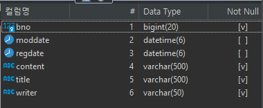

# p.251 (@MappedSuperclass)

---

부모 클래스는 테이블과 매핑하지 않고 부모 클래스는 상속받는 자식 클래스에게 매핑 정보만 제공하고 싶으면 `@MappedSuperclass` 를 사용하면 된다.

`@MappedSuperclass` 는 비유를 하면 추상 클래스와 비슷하다.

`@Entity` 는 실제 테이블과 매핑되지만 `@MappedSuperclass` 는 실제 테이블과는 매핑되지 않는다. (단순히 매핑 정보를 상속할 목적으로만 사용)

```jsx
class Member {
	private Long id;           // 공통속성
	private String name;       // 공통속성
	private String email;
}

class Seller {
	private Long id;           // 공통속성
	private String name;       // 공통속성
	private String shopname;
}
```

```jsx
class BaseEntity {
	private Long id;
	private String name;
}
```



Board 테이블 - moddate, regdate 가 추가되어있음

***@AttributeOverride***

*부모로부터 물려받은 매핑 정보를 재정의할 수 있다.*

***@MappedSuperclass***

*테이블과 매핑되지 않고 자식 클래스에 엔티티의 매핑 정보를 상속하기 위해 사용한다.* 

*@MappedSuperclass 로 지정한 클래스는 엔티티가 아니므로 em.find() 나 JPQL 에서 사용할 수 없다.*

***@Entity***

*엔티티는 엔티티이거나 @MappedSuperclass 로 지정한 클래스만 상속받을 수 있다.*