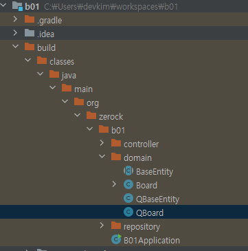
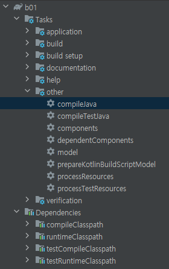

# p.449 (QueryDSL-WorkBook)

---

```jsx
buildscript {
	ext {
		queryDslVersion = "5.0.0"
	}
}
...
//QueryDSL
implementation "com.querydsl:querydsl-jpa:${queryDslVersion}"

annotationProcessor(
		"javax.persistence:javax.persistence-api",
		"javax.annotation:javax.annotation-api",
		"com.querydsl:querydsl-apt:${queryDslVersion}:jpa"
)

sourceSets {
	main {
		java {
			srcDirs = ["$projectDir/src/main/java", "$projectDir/build/generated"]
		}
	}
}
```



Q도메인 클래스 생성



Q도메인 클래스 생성 확인

---

### Search Interface Test

```java
public interface BoardSearch {

    Page<Board> search1(Pageable pageable);
}
```

```java
public interface BoardRepository extends JpaRepository<Board, Long>, BoardSearch {
	...
}
```

```java
@DisplayName("Search 테스트")
@Test
public void testSearch1() {

    //2 page order by bno desc
    PageRequest pageable = PageRequest.of(1, 10, Sort.by("bno").descending());

    boardRepository.search1(pageable);
}
...
Hibernate: 
    select
        board0_.bno as bno1_0_,
        board0_.moddate as moddate2_0_,
        board0_.regdate as regdate3_0_,
        board0_.content as content4_0_,
        board0_.title as title5_0_,
        board0_.writer as writer6_0_ 
    from
        board board0_ 
    where
        board0_.title like ? escape '!' 
    order by
        board0_.bno desc limit ?,
        ?
Hibernate: 
    select
        count(board0_.bno) as col_0_0_ 
    from
        board board0_ 
    where
        board0_.title like ? escape '!'
```