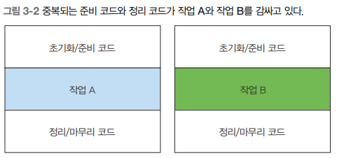

# Java8 : Modern Java In Action

---

### 람다 표현식

> **람다 표현식**은 메서드로 전달할 수 있는 익명 함수를 단순화한 것
> 

---

### 람다의 특징

> 익명 : 보통의 메서드와 달리 이름이 없으므로 익명이라 표현한다. 구현해야 할 코드에 대한 걱정거리가 줄어듦
함수 : 람다는 메서드처럼 특정 클래스에 종속되지 않으므로 함수라고 부른다.
전달 : 람다 표현식을 메서드 인수로 전달하거나 변수로 저장할 수 있다.
간결성 : 익명 클래스처럼 많은 자질구레한 코드를 구현할 필요가 없다.
> 

---

### 표현식

| 불리언 표현식 | (List<String> list) → list.isEmpty() |
| --- | --- |
| 객체 생성 | () → new Apple(10) |
| 객체에서 소비 | (Apple a) → { sout(a.getWeight()) } |
| 객체에서 선택/추출 | (String s) → s.length() |
| 두 값을 조합 | (int a, int b) → a * b |
| 두 객체 비교 | (Apple a1, Apple a2) → a1.getWeight().compareTo(a2.getWeight()) |

---

### 함수형 인터페이스

```java
// 오직 하나의 추상 메서드만 지정
public interface Predicate<T> { boolean test(T t); 
public interface Comparator<T> { int compare(T o1, T o2); }
public interface ActionListener extends EventListener { void actionPerformed(ActionEvent e); }
public interface Callable<V> { V call() throws Exception; }
public interface PrivilegedAction<T> { T run(); } 
```

---

### 함수 디스크립터

> Runnable 인터페이스는 인수와 반환값이 없는 시그니처이므로 **() → void** 표기
> 

> public void process(Runnable r) { r.run() } 
process(() → System.out.println(”This is awesome!!”));
> 

> **FunctionalInterface**
추상 메서드가 한 개 이상이라면 “Multiple nonoverriding abstract methos found in interface Foo”
> 

---

### **람다 활용 : 실행 어라운드 패턴**

```java
// 자원 처리(데이터베이스의 파일 처리)에 사용하는 순환 패턴은 자원을 열고, 처리한 다음(설정), 자원을 닫는 순서(정리)
// try-with-resources -> 사용하면 자원을 명시적으로 닫을 필요가 없으므로 간결한 코드를 구현하는데 도움을 준다.
public String processFile() throws IOException {
	try (BufferedReader br = new BufferedReader(new FileReader("data.txt"))) {
		return br.readLine(); // 실제 필요한 작업을 하는 행
	}
}
```



---

### **동작 파라미터화를 기억하라**

1. 위의 코드는 파일에서 한 번에 한 줄만 읽을 수 있다. 
2. 정리 과정은 재사용하고 processFile 메서드만 다른 동작을 수행하도록 명령할 수 있다면 좋을 것이다.
3. processFile의 동작을 파라미터화하는 것이다.
4. BufferedReader를 이용해서 다른 동작을 수행할 수 있도록 processFile 메서드로 동작을 전달해야 한다.
5. 람다를 이용해서 동작을 전달할 수 있다.

```java
String result = processFile((BufferedReader br) → br.readLine() + br.readLine());
```

---

### **함수형 인터페이스를 이용해서 동작 전달**

```java
@FuntionalInterface
public interface BufferedReaderProcessor {
	String process(BufferedReader b) throws IOException;
}
// 정의한 인터페이스를 processFile 메서드의 인수로 전달할 수 있다.
public String processFile(BufferedReaderProcessor p) throws IOException {
	...
}
```

---

### 동작 실행

> BufferedReaderProcessor에 정의된 process 메서드의 시그니처(BufferedReader → String)와 일치하는 람다를 전달할 수 있다.
> 

```java
public String processFile(BufferedReaderProcessor p) throws IOException {
	try (BufferedReader br = new BufferedReader(new FileReader("data.txt"))) {
		return p.process(br); // BufferedReader 객체 처리
	}
}
```

---

### 람다 전달

```java
// 한 행을 처리하는 코드
String oneLine = processFile((BufferedReader br) -> br.readLine());
// 두 행을 처리하는 코드
String twoLines = processFile((BufferedReader br) -> br.readLine() + br.readLine());
```

1. **Predicate**
    
    > test라는 추상 메서드를 정의하며 test는 제네릭 형식 T의 객체를 인수로 받아 불리언을 반환한다.
    > 
    
    ```java
    @FunctionalInterface
    public interface Predicate<T> { boolean test(T t); }
    ...
    public <T> List<T> filter(List<T> list, Predicate<T> p) {
    	List<T> results = new ArrayList<>();
    	for (T t: list)
    		if (p.test(t))
    			results.add(t);
    	return results;
    }
    Predicate<String> nonEmptyStringPredicate = (String s) -> !s.isEmpty();
    List<String> nonEmpty = filter(listOfStrings, nonEmptyStringPredicate); // 문자열이 있는 리스트
    ```
    
2. **Consumer**
    
    > 제네릭 형식 T 객체를 받아서 void를 반환하는 accept라는 추상 메서드를 정의한다.
    T 형식의 객체를 인수로 받아서 어떤 동작을 수행하고 싶을 때 Consumer 인터페이스를 사용할 수 있다.
    > 
    
    ```java
    @FunctionalInterface
    public interface Consumer<T> { void accept(T t); }
    ...
    public <T> void forEach(List<T> list, Consumer<T> c) {
    	for (T t: list) 
    		c.accept(t);
    }
    forEach(
    	Arrays.asList(1,2,3,4,5),
    	(Interger i) -> System.out.println(i) // Consumer의 accept 메서드를 구현하는 람다
    );
    ```
    
3. **Function**
    
    > 제네릭 형식 T를 인수로 받아서 제네릭 형식 R 객체를 반환하는 추상 메서드 apply를 정의한다.
    입력을 출력으로 매핑하는 람다를 정의할 때 Function 인터페이스를 활용할 수 있다.
    > 
    
    ```java
    @FunctionalInterface
    public interface Function<T, R> { R apply(T t); }
    ...
    public <T, R> List<R> map(List<T> list, Function<T, R> f) {
    	List<R> result = new ArrayList<>();
    	for (T t: list)
    		result.add(f.apply(t));
    	return result;
    }
    // [7, 2, 6]
    List<Integer> I = map(
    	Arrays.asList("lambdas", "in", "action"),
    	(String s) -> s.length() // Function의 apply 메서드를 구현하는 람다
    );
    ...
    String[] strings = {"lambdas", "in", "action", "duplic"};
    Stream<Integer> integerStream = Arrays.stream(strings).map((String s) -> s.length());
    
    Map<Integer, String> notEmptyMap = new LinkedHashMap<>(); // 비어있는 Map 제공 가능
    Map<Integer, String> collect = Arrays.stream(strings)
            .collect(Collectors.toMap(
                    String::length,
                    Function.identity(),
                    (olVal, newVal) -> newVal, // 중복되는 키가 있으면 maerge 가능
                    () -> notEmptyMap
            ));
    
    System.out.println(collect); // {2=in, 6=duplic, 7=lambdas}
    ```
    
4. **기본형 특화**
    
    > 자바의 모든 형식은 참조형 (ex. Byte, Integer, Object, List) 아니면 기본형 (ex. int, double, byte, char)에 해당 제네릭 파라미터(Consumer<T>의 T)에는 참조형만 사용할 수 있다. 자바에는 기본형을 참조형으로 변환하는 기능을 제공한다. 이 기능을 **박싱**이라고 한다.
    > 
    
    ```java
    List<Integer> list = new ArrayList<>();
    for (int i = 300; i < 400; i++) {
    	list.add(i);
    }
    ```
    
    ```java
    public interface IntPredicate { boolean test(int t); }
    ...
    IntPredicate evenNumbers = (int i) -> i % 2 == 0;
    evenNumbers.test(1000); // 참(박싱 없음)
    Predicate<Integer> oddNumbers = (Integer i) -> i % 2 != 0;
    oddNumbers.test(1000); // 거짓(박싱)
    ```
    
5. **객체의 최소값 최대값 비교**
    
    ```java
    Apple apply = BinaryOperator.minBy(Comparator.comparingInt(Apple::getWeight))
    						                .apply(new Apple(100, "red"), new Apple(160, "green"));
    System.out.println(apply); // 작은 무게를 가진 사과 객체를 반환한다.
    ```
    
6. **예외, 람다, 함수형 인터페이스의 관계**
    
    > 함수형 인터페이스는 확인된 예외를 던지는 동작을 허용하지 않는다. 예외를 던지는 람다 표현식을 만들려면 확인된 예외를 선언하는 함수형 인터페이스를 직접 정의하거나 try/catch 블록을 감싸야 한다.
    > 
    
    ```java
    @FunctionalInterface
    public interface BufferedReaderProcessor {
    	String process(BufferedReader b) throws IOException;
    }
    BufferedReaderProcessor p = (BufferedReaderProcessor  br) -> br.readLine();
    // ... 예외 잡는 방법
    Funtion<BufferedReader, String> f = (BufferedReader b) -> {
    	try {
    		return b.readLine();
    	} catch(IOException e) {
    		throw new RuntimeException(e);
    	}
    };
    ```
    
7. **형식 검사, 형식 추론, 제약**
    
    ```java
    List<Apple> heavierThan150g = filter(inventory, (Apple apple) -> apple.getWeight() > 150);
    ```
    
    > filter 메서드의 선언을 확인한다.
    filter 메서드는 두 번째 파라미터로 Predicate<Apple> 형식(대상 형식)을 기대한다.
    Predicate<Apple>은 test라는 한 개의 추상 메서드를 정의하는 함수형 인터페이스다.
    test 메서드는 Apple을 받아 boolean을 반환하는 함수 디스크립터를 묘사한다.
    filter 메서드로 전달된 인수는 이와 같은 요구사항을 만족해야 한다.
    > 
8. **같은 람다, 다른 함수형 인터페이스**
    
    ```java
    Callable<Integer> c = () -> 42;
    PrivilegedAction<Integer> p = () -> 42;
    ```
    
    이와 비슷한 예제가 있다.
    
    ```java
    Comparator<Apple> c1 = (Apple a1, Apple a2) -> a1.getWeight().compareTo(a2.getWeight());
    ToIntBiFunction<Apple, Apple> c2 = (Apple a1, Apple a2) -> a1.getWeight().compareTo(a2.getWeight());
    BIFunction<Apple, Apple, Integer> c3 = (Apple a1, Apple a2) -> a1.getWeight().compareTo(a2.getWeight());
    ```
    
9. peek vs map
    
    ```java
    List<Integer> numbers = Arrays.asList(1, 2, 3, 4, 5);
    
    List<Integer> squaredNumbers = numbers.stream()
                                        .peek(x -> System.out.println("Before map: " + x))
                                        .map(x -> x * x)
                                        .peek(x -> System.out.println("After map: " + x))
                                        .collect(Collectors.toList());
    // Before map: 1
    // After map: 1
    // Before map: 2
    // After map: 4
    // Before map: 3
    // After map: 9
    // Before map: 4
    // After map: 16
    // Before map: 5
    // After map: 25
    // [1, 4, 9, 16, 25]
    ```
    
    ```java
    List<Integer> numbers = Arrays.asList(1, 2, 3, 4, 5);
    
    List<Integer> squaredNumbers = numbers.stream()
                                        .map(x -> x * x)
                                        .collect(Collectors.toList()); 
    // [1, 4, 9, 16, 25]
    ```
    
    ```java
    String[] strArr = new String[]{"A", "B", "C", "", "D"};
    List<String> stringList = new ArrayList<>(Arrays.asList(strArr));
    stringList.stream()
              .filter(s -> !s.isEmpty())
              .peek(resultList1::add)
              .forEach(System.out::println); // A B C D
    // peek은 filter된 값을 중간연산 후 stream으로 반환하여 forEach로 결과 값을 출력 
    stringList.stream()
              .filter(s -> !s.isEmpty())
              .map(resultList1::add)
              .forEach(System.out::println); // true true true true
    // map은 filter된 값에 map한 결과 값을 반환하여 forEach로 결과 값을 출력
    ```
    
10. **형식 추론**
    
    > 자바 컴파일러는 람다 표현식이 사용된 콘텍스트(대상 형식)를 이용해서 람다 표현식과 관련된 함수형 인터페이스를 추론한다.
    대상 형식을 이용해서 함수 디스크립터를 알 수 있으므로 컴파일러는 람다의 시그니처도 추론할 수 있다.
    결과적으로 컴파일러는 람다 표현식의 파라미터 형식에 접근할 수 있으므로 람다 문법에서 이를 생략할 수 있다.
    > 
    
    ```java
    List<Apple> greenAplles = filter(inventory, apple -> GREEN.equals(apple.getColor()));
    ```
    
    > 여러 파라미터를 포함하는 람다 표현식에서는 코드 가독성 향상이 더 두드러진다.
    > 
    
    ```java
    Comparator<Apple> c = (Apple a1, Apple a2) -> a1.getWeight().compareTo(a2.getWeight()); // 형식을 추론하지 않음
    Comparator<Apple> c = (a1, a2) -> a1.getWeight().compareTo(a2.getWeight()); // 형식을 추론함
    ```
    
11. **지역 변수 사용**
    
    > 람다 표현식에서는 익명 함수가 하는 것처럼 자유 변수(외부에서 정의된 변수)를 활용할 수 있다. (= 람다 캡쳐링)
    > 
    
    ```java
    int portNumber = 1337;
    Runnable r = () -> System.out.println(portNumber);
    ```
    
    > 자유 변수에도 약간의 제약이 있다. 
    람다는 인스턴스 변수와 정적 변수를 자유롭게 캡처 (자신의 바디에서 참조할 수 있도록)할 수 있다.
    하지만 그러려면 지역 변수는 명시적으로 final로 선언되어 있어야 하거나 실질적으로 final로 선언된 변수와 똑같이 사용되어야 한다. 
    즉, 람다 표현식은 한 번만 할당할 수 있는 지역 변수를 캡처할 수 있다.
    (참고 : 인스턴스 변수 캡처는 final 지역 변수 this를 캡처하는 것과 마찬가지다).
    > 
    
    ```java
    int portNumber = 1337;
    Runnable r = () -> System.out.println(portNumber);
    portNumber = 31337;
    ```
    
12. **지역 변수의 제약**
    
    인스턴수 변수와 지역 변수는 태생부터 다르다.
    인스턴스 변수는 힙에 저장되는 반면 지역 변수는 스택에 위치한다.
    
    람다에서 지역 변수에 바로 접근할 수 있다는 가정하에 람다가 스레드에서 실행된다면 변수를 할당한 스레드가 사라져서 변수 할당이 해제되었는데도 람다를 실행하는 스레드에서는 해당 변수에 접근하려 할 수 있다.
    
    따라서 자바 구현에서는 원래 변수에 접근을 허용하는 것이 아니라 자유 지역 변수의 복사본을 제공한다.
    
    따라서 복사본의 값이 바뀌지 않아야 하므로 지역 변수에는 한 번의 값을 할당해야 한다는 제약이 생긴 것이다.
    
    또란 지역 변수의 제약 때문에 외부 변수를 변화시키는 일반적인 명령형 프로그래밍 패턴(병렬화를 방해하는 요소로 나중에 설명한다)에 제동을 걸 수 있다.
    
13. **메서드 참조**
    
    > 메서드 참조를 이용하면 기존의 메서드 정의를 재활용해서 람다처럼 전달할 수 있다.
    > 
    
    ```java
    inventory.sort((Apple a1, Apple a2) -> a1.getWeight().compareTo(a2.getWeight()));
    ```
    
    다음은 메서드 참조와 java.util.Comparator.comparing을 활용한 코드다.
    
    ```java
    inventory.sort(comparing(Apple::getWeight));
    ```
    

---

### 요약

| 람다 | 메서드 참조 단축 표현 |
| --- | --- |
| (Apple apple) → apple.getWeight() | Apple::getWeight |
| () → |  |
| Thread.currentThread().dumpStack() | Thread.currentThread()::dumpStack |
| (str, i) → str.substring(i) | String::substring |
| (String s) → System.out.println(s) | System.out::println |
| → this. isValidName(s) | this::isValidName |

### 메서드참조 만드는 방법

1. 정적 메서드 참조
    
    예를 들어 Integer의 parseInt 메서드는 Integer::parseInt로 표현할 수 있다.
    
2. 다양한 형식의 인스턴스 메서드 참조
    
    예를 들어 String의 length 메서드는 String::length로 표현할 수 있다.
    
3. 기존 객체의 인스턴스 메서드 참조
    
    예를 들어 Transaction 객체를 할당받은 expensiveTransaction 지역 변수가 있고, 
    Transaction 객체에는 getValue 메서드가 있다면, 이를 exprensiveTransaction::getValue라고 표현할 수 있다.
    

```java
private boolean isValidName(String string) {
	return Character.isUpperCase(string.charAt(0));
}
...
// Predicate<String>를 필요로 하는 적당한 상황에서 메서드 참조를 사용할 수 있다.
filter(words, this::isValidName)
```

> **Comparator는 (T, T) → int라는 함수 디스크립터를 갖는다.**
> 

```java
List<String> str = Arrays.asList("a", "b", "A", "B");
str.sort((s1, s2) -> s1.compareToIgnoreCase(s2));
```


```java
List<String> str = Arrays.asList("a", "b", "A", "B");
str.sort(String::compareToIgnoreCase);
```

---

### 생성자 참조

ClassName::new처럼 클래스명과 new 키워드를 이용해서 기존 생성자의 참조를 만들 수 있다.

```java
Supplier<Apple> c1 = Apple::new;
Apple a1 = c1.get() // Supplier의 get 메서드를 호출해서 새로운 Apple 객체를 만들 수 있다.
// 위 예제와 다음 코드와 같다.
Supplier<Apple> c1 = () -> new Apple(); // 람다 표현식은 디폴트 생성자를 가진 Apple을 만든다.
Apple a1 = c1.get(); // Supplier get 메서드를 호출해서 새로운 Apple 객체를 만들 수 있다.
```

Apple(Integer weight)라는 시그니처를 갖는 생성자는 Function 인터페이스의 시그니처와 같다.

```java
// Apple.class
public Apple(int weight) {
	this.weight = weight;
}
// Application.class
// 방법1.
Function<Integer, Apple> f1 = Apple::new; // Apple(Integer weight)의 생성자 참조
Apple ap1 = f1.apply(110); // Function의 apply 메서드에 무게를 인수로 호출해서 새로운 Apple 객체를 만들 수 있다.
// 방법2.
Function<Integer, Apple> f2 = (weight) -> new Apple(weight); // 특정 무게의 사과를 만든다는 람다 표현식
Apple ap2 = f2.apply(110); // Function의 apply 메서드에 무게를 인수로 호출해서 새로운 Apply 객체를 만들 수 있다.
```

다음 코드에서 Integer를 포함하는 리스트의 각 요소를 우리가 정의했던 map 같은 메서드를 이용해서 Apple 생성자로 전달한다.

결과적으로 다양한 무게를 포함하는 사과 리스트가 만들어진다.

```java
List<Integer> weights = Arrays.asList(7, 3, 4, 10);
List<Apple> apples = map(weights, Apple::new);

public static List<Apple> map(List<Integer> list, Function<Integer, Apple> f) {
    List<Apple> result = new ArrayList<>();
    for (Integer i : list) {
        result.add(f.apply(i));
    }
    return result;
}
```

Apple(String color, Integer weight)처럼 두 인수를 갖는 생성자는 BiFunction 인터페이스와 같은 시그니처를 가지므로 다음처럼 할 수 있다.

```java
// Apple.class
public Apple(String color, int weight) {
	this.color = color;
	this.weight = weight;
}
// 방법1.
BiFunction<Color, Integer, Apple> c3 = Apple::new; // Apple(String color, Integer weight)의 생성자 참조
Apple a3 = c3.apply(GREEN, 110); // BiFunction의 apply 메서드에 색과 무게를 인수로 제공해서 새로운 Apple 객체를 만들 수 있다.
// 방법2.
BiFunction<Color, Integer, Apple> c3 = (color, weight) -> new Apple(color, weight); // Apple(String color, Integer weight)의 생성자 참조
Apple a3 = c3.apply(GREEN, 110); // BiFunction의 apply 메서드에 색과 무게를 인수로 제공해서 새로운 Apple 객체를 만들 수 있다.
```

인스턴스화하지 않고도 생성자에 접근할 수 있는 기능을 다양한 상황에 응용할 수 있다.

예를들어 Map으로 생성자와 문자열값을 관련시킬 수 있다. 그리고 String과 Integer가 주어졌을 때 다양한 무게를 갖는 여러 종류의 과일을 만드는 giveMeFruit라는 메서드를 만들 수 있다.

```java
static Map<String, Function<Integer, Fruit>> map = new HashMap<>();
static {
	map.put("apple", Apple::new);
	map.put("orange", Orange::new);
  // 등등
}
public static Fruit giveMeFruit(String fruit, Integer weight) {
	return map.get(fruit.toLowerCase())
						.apply(weight);
}
```

---

### 람다, 메서드 참조 활용하기 (http://www.hanbit.co.kr/src/10202 소스 내려받기)

```java
inventory.sort(comparing(Apple::getWeight));
```

> **1단계 : 코드전달**
> 

자바 8의 List API에서 sort 메서드를 제공하므로 정렬 메서드를 직접 구현할 필요는 없다. 그런데 어떻게 sort 메서드에 정렬 전략을 전달할 수 있을까? sort 메서드는 다음과 같은 시그니처를 갖는다.

```java
void sort(Comparator<? super E> c)
```

이 코드는 Comparator 객체를 인수로 받아 두 사과를 비교한다. 이제 ‘sort의 동작은 파라미터화되었다’라고 말할 수 있다.

즉, sort에 전달된 정렬 전략에 따라 sort의 동작이 달라질 것이다.

```java
public class AppleComparator implements Comparator<Apple> {
	public int compare(Apple a1, Apple a2) {
		return a1.getWeight().compareTo(a2.getWeight);
	}
}
inventory.sort(new AppleComparator());
```

> **2단계 : 익명 클래스 사용**
> 

한 번만 사용할 Comparator를 위 코드처럼 구현하기 보다는 익명 클래스를 이용하는 것이 좋다.

```java
inventory.sort(new Comparator<Apple>() {
	public int compare(Apple a1, Apple a2) {
		return a1.getWeight.compareTo(a2.getWeight);
	}
})
```

> **3단계 : 람다 표현식 사용**
> 

추상 메서드의 시그니처(함수 디스크립터라 불림)는 람다 표현식의 시그니처를 정의한다.

***Comparator***의 함수 디스크립터는 (T, T) → int다. 우리는 사과를 사용할것이므로 더 정확히는 (Apple, Apple) → int로 표현할 수 있다.

```java
inventory.sort((Apple a1, Apple a2) -> a1.getWeight().compareTo(a2.getWeight));
```

자바 컴파일러는 람다 표현식이 사용된 콘텍스트를 활용해서 람다의 파라미터 형식을 추론한다고 설명했다.

**따라서 코드를 더 줄일 수 있다.**

```java
inventory.sort((a1, a2) -> a1.getWeight().compareTo(a2.getWeight));
```

**가독성을 더 향상시켜보자.**

***Comparator***는 ***Compareble*** 키를 추출해서 ***Comparator*** 객체로 만드는 ***Function*** 함수를 인수로 받는 정적 메서드 ***comparing***을 포함한다.

```java
Comparator<Apple> c = Comparator.comparing((Apple a) -> a.getWeight());
```

간소화해보자.

```java
import static java.util.Comparator.comparing;
// 방법1.
inventory.sort(comparing(apple -> apple.getWeight()));
// 방법2.
inventory.sort(comparing(Apple::getWeight));
```

> **4단계 : 메서드 참조 사용**
> 

---

### 람다 표현식을 조합할 수 있는 유용한 메서드

자바 8에서 몇몇 함수형 인터페이스는 다양한 유틸리티 메서드를 포함한다.

예를 들어 ***Comparator, Function, Predicate*** 같은 함수형 인터페이스는 람다 표현식을 조합할 수 있도록 ***유틸리티 메서드***를 제공한다.

**간단히 말해, 여러 개의 람다 표현식을 조합해서 복잡한 람다 표현식을 만들 수 있다는 것이다.**

예를 들어 두 프리디케이트를 조합해서 두 프리디케이트 or 연산을 수행하는 커다란 프리디케이트를 만들 수 있다.

**또한 한 함수의 결과가 다른 함수의 입력이 되도록 두 함수를 조합할 수도 있다.**

여기서 등장하는 것이 바로 디폴트 메서드다.

---

### Comparator 조합

정적 메서드 Comparator.comparing을 이용해서 비교에 사용할 키를 추출하는 Function 기반의 Comparator를 반환할 수 있다.

### 역정렬

사과의 무게를 내림차순으로 정렬하고 싶다면 어떻게 해야 할까? 다른 Comparator 인스턴스를 만들 필요가 없다.

인터페이스 자체에서 주어진 비교자의 순서를 바꿔주는 reverse라는 디폴트 메서드를 제공하기 때문이다

```java
inventory.sort(comparing(Apple::getWeight).reversed()); // 무게를 내림차순으로 정렬
```

### Comparator 연결

하지만 무게가 같은 사과가 존재한다면 어떻게 해야 할까?

비교 결과를 더 다듬을 수 있는 두번째 Comparator를 만들 수 있다.

예를 들어, 무게가 같다면 원산지 국가별로 사과를 정렬할 수 있다.

```java
inventory.sort(comparing(Apple::getWeight)
				 .reversed() // 무게를 내림차순으로 정렬
         .thenComparing(Apple::getCountry)); // 두 사과의 무게가 같다면 국가별로 정렬
```

### ***Predicate*** 조합

***Predicate 인터페이스***는 복잡한 프레디케이트를 만들 수 있도록 ***negate, and, or*** 세 가지 메서드를 제공한다.

```java
Predicate<Apple> notRedApple = redApple.negate(); // 기존 프레디케이트 객체 redApple의 결과를 반전시킨 객체를 만든다.
```

또한 and 메서드를 이용해서 빨간색이면서 무거운 사과를 선택하도록 두 람다를 조합할 수 있다.

```java
Predicate<Apple> redAndHeavyApple 
					= readApple.and(apple -> apple.getWeight() > 150); // 두 프레디케이터 연결 후 새로운 프레디케이트 객체를 만든다.
```

그뿐만 아니라 or을 이용해서 ‘빨간색이면서 무거운 사과 또는 그냥 녹색 사과 등 다양한 조건을 만들 수 있다.’

```java
Predicate<Apple> redAndHeavyAppleOrGreen
				= readApple.and(apple -> apple.getWeight() > 150)
					.or(apple -> GREEN.equals(a.getColor())); // 프레디케이트 메서드르 연결해서 복잡한 프레디케이트 객체를 만든다.
```

### ***Function*** 조합

***Function 인터페이스***는 ***Function 인스턴스***를 반환하는 ***andThen, compose*** 두 가지 ***디폴트 메서드***를 제공한다.

***andThen 메서드***는 주어진 함수를 먼저 적용한 결과를 다른 함수의 입력으로 전달하는 함수를 반환한다.

```java
Function<Integer, Integer> f = x -> x + 1;
Function<Integer, Integer> g = x -> x * 2;
Function<integer, Integer> h = f.andThen(g);
int result = h.apply(1); // 4
```

***compose 메서드***는 인수로 주어진 함수를 먼저 실행한 다음에 그 결과를 외부 함수의 인수로 제공한다.

***f.andThen(g)***에서 ***andThen*** 대신에 ***compose***를 사용하면 ***g(f(x))***가 아니라 ***f(g(x))***라는 수식이 된다.

```java
Function<Integer, Integer> f = x -> x + 1;
Function<Integer, Integer> g = x -> x * 2;
Function<integer, Integer> h = f.compose(g);
int result = h.apply(1); // 3
```

# 스트림 소개

---

### 스트림이란 무엇인가?

```java
List<Dish> lowcaloricDishes = new ArrayList<>();
for (Dish dish: menu) {
	if (dish.getCaloiries() < 400) {
		lowCaloricDishes.add(dish);
	}
}
Collections.sort(lowCaloricDishes, new Comparator<Dish>() {
	public int compare(Dish dish1, Dish dish2) {
		return Integer.compare(dish1.getCalories(), dish2.getCalories());
	}
});
List<String> lowCaloricDishsName = new ArrayList<>();
for (Dish dish: lowCaloricDishes) {
	lowCaloricDishesName.add(dish.getName()); // 정렬된 리스트 처리하면서 요리 이름 선택
}
```

```java
import static java.util.Comparator.comparing;
import static java.util.stream.Collectors.toList;

List<String> lowCaloricDishsName = 
					menu.stream()
							.filter(d -> d.getCalories() < 400)
						  .sort(comparing(Dish::getCalories)
							.map(Dish::getName)
			        .collect(toList());
// 병렬로 실행 시
List<String> lowCaloricDishsName = 
					menu.parallelStream()
							.filter(d -> d.getCalories() < 400)
						  .sort(comparing(Dish::getCalories)
							.map(Dish::getName)
			        .collect(toList());
```

***parallelStream()***을 호출했을 때 정확히 어떤 일이 일어날까? 얼마나 많은 스레드가 사용되는 걸까? 얼마나 성능이 좋을까?

> 선언형으로 코드를 구현할 수 있다. 즉, 루프와 if 조건문 등의 제어 블록을 사용해서 어떻게 동작을 구현할지 지정할 필요 없이
’저칼로리의 요리만 선택하라’ 같은 동작의 수행을 지정할 수 있다.
> 

***filter (또는 sorted, map, collect)*** 같은 연산은 **고수준 빌딩 블록**으로 이루어져 있으므로 특정 스레딩 모델에 제한되지 않고 자유롭게 어떤 상황에서든 사용할 수 있다. 결과적으로 우리는 데이터 처리 과정을 병렬화하면서 스레드와 락을 걱정할 필요가 없다.


**스트림 API는 매우 비싼 연산이다.** 예를 들어 4, 5, 6장을 학습하고 나면 여러분은 다음과 같은 코드를 구현할 수 있게 된다.

```java
Map<Dish.Type, List<Dish>> dishesByType = 
		menu.stream().collect(groupingBy(Dish::getType));
// ...
{
	FISH=[prawns, salmon],
	OTHER=[french fries, rice, season fruit, pizza],
	MEAT=[pork, beef, chicken]
}
```

### 딱 한 번만 탐색할 수 있다.

반복자와 마찬가지로 스트림도 한 번만 탐색할 수 있다. 즉, 탐색된 스트림의 요소는 소비된다.

다시 탐색을 위해서는 초기 데이터 소스에서 새로운 스트림을 만들어야 한다.

```java
List<String> title = Arrays.asList("Java8", "In", "Action");
Stream<String> s = title.stream();
s.forEach(System.out::println); // title의 각 단어를 출력
s.forEach(System.out::println); // java.lang.illegalStateException: 스트림이 이미 소비되었거나 닫힘.
```

### 스트림 : 내부 반복

```java
List<String> highCaloricDishes = new ArrayList<>();
Iterator<String> iterator = menu.iterator();
while(iterator.hasNext()) {
	Dish dish = iterator.next();
	if (dish.getCalories() > 300) {
		highCaloricDishes.add(d.getName());
	}
}
// 스트림 리팩터림
List<String> names = menu.stream()
		.filter(dish -> dish.getCalories() > 300)
		.map(Dish::getName)
		.collect(toList());
```

### 중간 연산

```java
List<String> names =
                menu.stream()
                        .filter(dish -> {
                            System.out.println("filtering: " + dish.getName());
                            return dish.getCalories() > 300;
                        })
                        .map(dish -> {
                            System.out.println("mapping: " + dish.getName());
                            return dish.getName();
                        })
                        .limit(3)
                        .collect(Collectors.toList());
// System.out.println(names);
// filtering: pork
// mapping: pork
// filtering: beef
// mapping: beef
// filtering: chicken
// mapping: chicken
// [pork, beef, chicken]
```

### 최종 연산

```java
long count = menu.stream()
                .filter(d -> d.getCalories() > 300)
                .distinct()
                .limit(3)
                .count();
System.out.println(count); // 3
```

# 스트림 활용

---

다음은 데이터 컬렉션 반복을 명시적을 관리하는 외부 반복 코드다.

```java
List<Dish> befetarianDishes = new ArrayList<>();
for (Dish d: menu) {
	if (d.isVegetarian()) {
		vegetarianDishes.add(d);
	}
}
```

명시적 반복 대신 filter와 collect 연산을 지원하는 스트림 API를 이용해서 데이터 컬렉션 반복을 내부적으로 처리할 수 있다.

```java
List<Dish> begetarianDishes = 
	menu.stream()
		.filter(Dish::isVegertarian)
		.collect(Collectors.toList());
```

데이터를 어떻게 처리할지는 스트림 API가 관리하므로 편리하게 데이터 관련 작업을 할 수 있다.

따라서 스트림 API 내부적으로 다양한 최적화가 이루어질 수 있다.

스트림 API는 내부 반복 뿐 아니라 코드를 병렬로 실행할지 여부도 결정할 수 있다.

# 스트림 슬라이싱

---

### ***프레디케이트를*** 이용한 ***슬라이싱***

```java
List<Dish> specialMenu = Arrays.asList(
                new Dish("seasonal fruit", true, 120, Dish.Type.OTHER),
                new Dish("prawns", false, 300, Dish.Type.FISH),
                new Dish("rice", true, 350, Dish.Type.OTHER),
                new Dish("chicken", false, 400, Dish.Type.MEAT),
			          new Dish("french fries", true, 530, Dish.Type.OTHER)
);

List<Dish> filteredMenu = specialMenu.stream()
        .filter(dish -> dish.getCalories() < 320)
        .collect(Collectors.toList());
System.out.println(filteredMenu); // [seasonal fruit, prawns]
```

filter 연산을 이용하면 전체 스트림을 반복하면서 각 요소에 프레디케이트를 적용하게 된다.

따라서 **리스트가 이미 정렬되어있다는 사실**을 이용해 반복 작업을 중단할 수 있다.

작은 리스트에서는 이와 같은 동작이 별거 아닌 것처럼 보일 수 있지만 
아주 많은 요소를 포함하는 큰 스트림에서는 상당한 차이가 될 수 있다.

***takeWhile* 활용** 

무한 스트림을 포함한 모든 스트림에 프레디케이트를 적용해 스트림을 슬라이스할 수 있다.

```java
List<Dish> sliceMenu1 = specialMenu.stream()
        .takeWhile(dish -> dish.getCalories() < 320)
        .collect(Collectors.toList());
System.out.println(sliceMenu1); // [seasonal fruit, prawns]
```

***Dropwhile* 활용**

takeWhile과 정반대의 작업을 수행한다. 프레디케이트가 처음으로 거짓이 되는 지점까지 발견된 요소를 버린다.

```java
List<Dish> sliceMenu2 = specialMenu.stream()
        .dropWhile(dish -> dish.getCalories() < 320)
        .collect(Collectors.toList());
System.out.println(sliceMenu1); // [rice, chicken, french fries]
```

### 요소 건너뛰기

스트림은 처음 n개 요소를 제외한 스트림을 반환하는 skip(n) 메서드를 지원한다.

***limit(n)***과 ***skip(n)***은 상호 보완적인 연산을 수행한다.

```java
List<Dish> dishes = menu.stream()
        .filter(d -> d.getCalories() > 300)
        .skip(2)
        .collect(Collectors.toList());
System.out.println(dishes); // [chicken, french fries, rice, pizza, salmon]
```

# 매핑

---

### 스트림의 각 요소에 함수 적용하기

인수로 제공된 함수는 각 요소에 적용되며 함수를 적용한 결과가 새로운 요소로 매핑된다.(’새로운 버전을 만든다’라는 개념에 가까움)

```java
List<String> words = Arrays.asList("Modern", "Java", "In", "Action");
List<Integer> wordLengths = words.stream()
												        .map(String::length)
												        .collect(Collectors.toList());
System.out.println(wordLengths); // [6, 4, 2, 6]
```

각 요리명의 길이를 알고 싶다면 어떻게 해야할까?

다른 map 메서드를 ***연결(chaining)***할 수 있다.

```java
List<Integer> dishNameLengths = menu.stream()
													        .map(Dish::getName)
													        .map(String::length)
													        .collect(Collectors.toList());
System.out.println(dishNameLengths); // [4, 4, 7, 12, 4, 12, 5, 6, 6]
```

### ***스트림 평면화***

예를 들어 [”Hello”, “World”] 리스트가 있다면 결과로 [”H”, “e”, “l”, “o”, “W”, “r”, “d”]를 포함하는 리스트가 반환되어야 한다.

```java
List<String> wordsStreamSplit = words2.stream()
													        .map(word -> word.split(""))
													        .flatMap(Arrays::stream)
													        .distinct()
													        .collect(Collectors.toList());
System.out.println(wordsStreamSplit); // [H, e, l, o, W, r, d]
```

### ***map***과 ***Arrays.stream*** 활용

```java
String[] arrayOfWords = {"Goodbye", "World"};
Stream<String> streamOfWords = Arrays.stream(arrayOfWords);

List<Stream<String>> mapStream = words.stream()
														        .map(word -> word.split("")) // 각 단어를 개별 문자열 배열로 변환
														        //.forEach(array -> System.out.println(Arrays.toString(array))); // [H, e, l, l, o] \n [W, o, r, l, d]
														        .map(Arrays::stream) // 각 배열을 별도의 스트림으로 생성
														        .distinct()
														        .collect(toList());
System.out.println(mapStream);
// 문제가 해결되지 않았다. 문제를 해결하려면 먼저 각 단어를 개별 문자열로 이루어진 배열로 만든 다음에 각 배열을 별도의 스트림으로 만들어야 한다.

List<String> uniqueCharacters = words.stream()
													        .map(word -> word.split("")) // 각 단어를 개별 문자를 포함하는 배열로 변환
													        .flatMap(Arrays::stream) // 생성된 스트림을 하나의 스트림으로 평면화
													        .distinct()
													        .collect(toList());
System.out.println(uniqueCharacters);
```

연습문제

```java
List<Integer> number1 = Arrays.asList(1, 2, 3);
List<Integer> number2 = Arrays.asList(4, 5);
List<int[]> pairs = number1.stream()
								        .flatMap(i -> number2.stream().map(j -> new int[]{i, j}))
								        .collect(toList());
pairs.forEach(pair -> System.out.println(Arrays.toString(pair))); 
// List<Array>이기 때문에 System.out.println(pairs)를 하게되면 주소값이 나오게된다.
// 실제 값을 보기위해서는 순회후 Arrays.toString()을 이용하면 된다.
```

# 검색과 매칭

---

검색하는 스트림 API는 ***allMatch. anyMatch, noneMatch, findFirst, findAny***  등 다양한 유틸리티 메서드를 제공한다.

### ***anyMatch*** 적어도 한 요소와 일치하는지 확인

```java
if (menu.stream().anyMatch(Dish::isVegetarian)) {
	System.out.println("The menu is (somewaht) vegetarian friendly!!");
}
```

### ***allMatch*** 모든 요소가 주어진 프레디케이트와 일치하는지 검사

```java
boolean isHealthy = menu.stream()
											.allMatch(dish -> dish.getCalories() < 1000);
```

### ***nonMatch*** 일치하는 요소가 없는지 확인

```java
boolean isHealthy = menu.stream()
											.noneMatch(d -> d.getCalories() >= 1000);
```

***anyMath, allMatch, noneMatch*** 새 메서드는 ***스트림 쇼트서킷*** 기법, 즉 자바의 ***&&, ||***와 같은 연산을 활용한다.

## 요소 검색

***findAny*** 현재 스트림에서 임의의 요소를 반환한다. ***findAny*** 메서드를 다른 스트림과 연결해서 사용할 수 있다.

```java
Optional<Dish> dish = menu.stream()
												.filter(Dish::isVegetarian)
												.findAny();
```

### Optional이란?

***Optional<T>*** 클래스(***java.util.Optional***)는 값의 존재나 부재 여부를 표현하는 컨테이너 클래스다.

이전 예제에서 ***findAny***는 아무 요소도 반환하지 않을 수 있다.

***null***은 쉽게 에러를 일으킬 수 있으므로 자바 8 라이브러리 설계자는 Optional<T>를 만들었다.

- ***isPresent()***는 ***Optional***이 값을 포함하면 ***참(true)***을 반환하고, 값을 포함하지 않으면 ***거짓(false)***을 반환한다.
- ***ifPresent(Consumer<T> block)***은 값이 있으면 주어진 블록을 실행한다. ***Consumer*** 함수형 인터페이스는 3장에서 설명했다.
***Consumer*** 함수형 인터페이스에는 ***T*** 형식의 인수를 받으며 ***void***를 반환하는 람다를 전달할 수 있다.
- ***T get()***은 값이 존재하면 값을 반환하고, 값이 없으면 ***NoSuchElementException***을 일으킨다.
- ***T orElse(T other)***는 값이 있으면 값을 반환하고, 값이 없으면 ***기본값***을 반환한다.

예를 들어 이전 예제의 ***Optional<Dish>***에서는 요리명이 ***null***인지 검사할 필요가 없었다.

```java
menu.stream()
	.filter(Dish::isVegetarian)
	.findAny()
	.ifPresent(dish -> System.out.println(dish.getName()));
```

### 첫 번째 요소 찾기

리스트 또는 정렬된 연속 데이터로부터 생성된 스트림처럼 일부 스트림에는 ***논리적인 아이템 순서***가 정해져 있을 수 있다.

예를 들어 숫자 리스트에서 3으로 나누어떨어지는 첫 번째 제곱값을 반환하는 다음 코드를 살펴보자.

```java
List<Integer> someNumbers = Arrays.asList(1, 2, 3, 4, 5);
Optional<Integer> firstSquareDivisibleByThree = someNumbers.stream()
																													.map(n -> n * n) // [1, 4, 9, 16, 25]
																													.filter(n -> n % 3 == 0) // [9]
																													.findFirst(); // 9	
```

### ***findFirst***와 ***findAny***는 언제 사용하나?

그런데 왜 ***findFirst***와 ***findAny*** 메서드가 모두 필요할까? 바로 ***병렬성*** 때문이다.

병렬 실행에서는 첫 번째 요소를 찾기 어렵다.

따라서 요소의 반환 순서가 상관없다면 ***병렬 스트림***에서는 제약이 적은 ***findAny***를 사용한다.

### 리듀싱

***리듀스연산***을 이용해서 ***‘메뉴의 모든 칼로리의 합계를 구하시오’***, ***‘메뉴에서 칼로리가 가장 높은 요리는?’*** 같이 스트림 요수를 조합해서 ***더 복잡한 질의를 표현***하는 방법을 설명한다.

이러한 질의를 수행하려면 ***Integer 같은 결과가 나올 때까지*** 스트림의 ***모든 요소***를 ***반복적***으로 처리해야 한다.

이런 질의를 리듀싱 연산(모든 스트림 요소를 처리해서 값으로 도출하는)이라고 한다.

### 요소의 합

***reduce***를 이용하면 애플리케이션의 ***반복된 패턴***을 ***추상화***할 수 있다.

```java
// 방법1.
int sum = numbers.stream().reduce(0, (a, b) -> a + b);
// 방법2. 메서드 참조
int sum = numbers.stream().reduce(0, Integer::sum);
```

리듀스는 두 개의 인수를 갖는다. 

- 초깃값 0
- 두 요소를 조합해서 새로운 값을 만드는 ***BinaryOperator<T>***. 예제에서는 람다 표현식 ***(a, b) → a + b***를 사용했다.

### 초깃값 없음

***초깃값***을 받지 않도록 ***오버로드***된 ***reduce***도 있다. 그러나 이 ***reduce***는 ***Optional 객체***를 ***반환***한다.

```java
Optional<Integer> sum = numbers.stream().reduce((a, b) -> (a + b));
```

왜 ***Optional<Integer>***를 반환하는 걸까? 스트림에 ***아무 요소도 없는 상황***을 생각해보자. 초깃값이 없으므로 ***reduce***는 합계를 반환할 수 없다.

### 최댓값과 최솟값

- 초깃값
- 스트림의 두 요소를 합쳐서 하나의 값으로 만드는 데 사용할 람다

```java
// 최댓값
Optional<Integer> max = numbers.stream().reduce(Integer::max);
// 최솟값
Optional<Integer> min = numbers.stream().reduce(Integer::min);
```

### ***reduce*** 메서드의 ***장점***과 ***병렬화***

기존의 단계적 반복으로 합계를 구하는 것과 ***reduce***를 이용해서 합계를 구하는 것은 어떠한 차이가 있을까?

***reduce***를 이용하면 내부 반복이 ***추상화***되면서 ***내부 구현에서 병렬***로 ***reduce***를 실행할 수 있게 된다.

반복적인 합계에서는 sum 변수를 공유해야 하므로 쉽게 병렬화하기 어렵다.

***강제적으로 동기화***시키더라도 결국 ***병렬화***로 얻어야 할 이득이 스레드 간의 소모적인 경쟁 때문에 상쇄되어 버린다는 사실을 알게 될 것이다.

사실 이 작업을 ***병렬화***하려면 ***입력을 분할***하고, ***분할된 입력***을 더한 다음에, 더한 값을 합쳐야 한다.


### 실전 연습

```java
Trader raoul = new Trader("Raoul", "Cambridge");
Trader mario = new Trader("Mario", "Milan");
Trader alan = new Trader("Alan", "Cambridge");
Trader brian = new Trader("Brian", "Cambridge");

List<Transaction> transactionList = Arrays.asList(
        new Transaction(brian, 2011, 300),
        new Transaction(raoul, 2012, 1000),
        new Transaction(raoul, 2011, 400),
        new Transaction(mario, 2012, 710),
        new Transaction(mario, 2012, 700),
        new Transaction(alan, 2012, 950)
);

// 2011년에 일어난 모든 트랜잭션을 찾아 값을 오름차순으로 정리하시오.
List<Transaction> tr2011 =
        transactionList.stream()
                .filter(item -> item.getYear() == 2011)
                .sorted(comparing(Transaction::getValue))
                .collect(toList());
// System.out.println(tr2011);

// 거래자가 근무하는 모든 도시를 중복 없이 나열하시오.
List<String> cities =
        transactionList.stream()
                .map(item -> item.getTrader().getCity())
                .distinct()
                .collect(toList());
// System.out.println(cities);

// 케임브리지에서 근무하는 모든 거래자를 찾아서 이름순으로 정렬하시오.
List<Trader> traders =
        transactionList.stream()
                .map(Transaction::getTrader)
                .filter(trader -> "Cambridge".toLowerCase().equals(trader.getCity().toLowerCase()))
                .distinct()
                .sorted(comparing(Trader::getName))
                .collect(toList());
// System.out.println(traders);

// 모든 거래자의 이름을 알파벳순으로 정렬해서 반환하시오.
String traderStr =
        transactionList.stream()
                .map(Transaction::getTrader)
                .map(Trader::getName)
                .distinct()
                .sorted()
                .collect(joining());
// System.out.println(traderStr);

// 밀라노에 거래자가 있는가?
boolean milanBased =
        transactionList.stream()
                .anyMatch(transaction -> "xx".toLowerCase()
                        .equals(transaction.getTrader()
                                .getCity()
                                .toLowerCase()));
// System.out.println(milanBased);

// 케임브리지에서 거주하는 거래자의 모든 트랜잭션값을 출력하시오.
transactionList.stream()
        .filter(transaction -> "Cambridge".toLowerCase().equals(transaction.getTrader()
                .getCity()
                .toLowerCase()))
        .map(Transaction::getValue)
        .forEach(System.out::println);

// 전체 트랜잭션 중 최댓값은 얼마인가?
Optional<Integer> highestValue =
        transactionList.stream()
                .map(transaction -> transaction.getValue())
                .reduce(Integer::max);
// System.out.println(highestValue);

// 전체 트랜잭션 중 최솟값은 얼마인가?
Optional<Transaction> smallestTransaction =
        transactionList.stream()
                .min(comparing(Transaction::getValue));
// System.out.println(smallestTransaction);
```

### 숫자형 스트림

```java
int calories = nemu.stream().map(Dish::getCalories).reduce(0, Integer::sum);
```

```java
int calories = menu.stream().map(Dish::getCalories).sum(); // 불가능
```

### 기본형 특화 스트림

스트림 API는 ***박싱 비용***을 피할 수 있도록 ***‘IntStream’, ‘DoubleStream’, ‘LongStream’***을 제공한다.

각각의 인터페이스는 sum, max 등 리듀싱 연산 수행 메서드를 제공한다.

### 숫자 스트림으로 매핑

스트림을 특화 스트림으로 변활 때는 ***mapToInt, mapToDouble, mapToLong*** 세 가지 메서드를 가장 많이 사용한다.

***map과 정확히 같은 기능을 수행***하지만, ***Stream<T>*** 대신 특화된 스트림을 반환한다.

```java
int calories = menu.stream().mapToInt(Dish::getCalories).sum();
```

### 객체 스트림으로 복원하기

IntStream의 map 연산은 ***‘int를 인수로 받아서 int를 반환하는 람다(IntUnaryOperator)’***를 인수로 받는다.

하지만 정수가 아닌 Dish 같은 다른 값을 반환하고 싶으면 어떻게 해야 할까?

```java
IntStream intStream = menu.stream().mapToInt(Dish::getCalories); // 스트림을 숫자 스트림으로 변환
Stream<Integer> stream = intStream.boxed(); // 숫자 스트림을 스트림으로 변환
```

### 기본값 : OptionalInt

***IntStream***에서 최댓값을 찾을 때는 0이라는 기본값 때문에 잘못된 결과가 도출 될 수 있다.

스트림에 요소가 없는 상황과 실제 최댓값이 0인 상황을 어떻게 구별할 수 있을까?

***Optional***을 ***Integer, String***등의 ***참조 형식***으로 파라미터화할 수 있다.

또한 ***OptionalInt, OptionalDouble, OptionalLong*** 세 가지 기본형 특화 스트림 버전도 제공한다.

예를 들어 다음처럼 OptionalInt를 이용해서 IntStream의 최갮값 요소를 찾을 수 있다.

```java
OptionalInt maxCalories = menu.stream().mapIntStream(Dish::getCalories).max();
```

이제 OptionalInt를 이용해서 최댓값이 없는 상황에 사용할 기본값을 명시적으로 정의할 수 있다.

```java
List<Integer> noMax = Arrays.asList();
System.out.println(noMax); // [] 빈 배열이면

OptionalInt optionalMax = noMax.stream().mapToInt(num -> num).max();
System.out.println(optionalMax); // OptionalInt.empty

int resultMax = optionalMax.orElse(1);
System.out.println(resultMax); // 1
```

### 숫자 범위

프로그램에서 특정 범위의 숫자를 이용해야 하는 상황이 자주 발생한다.

자바 8의 IntStream과 LongStream에서는 range와 rangeClose라는 두 가지 정적 메서드를 제공한다.

range 메서드는 시작값과 종료값이 결과에 포함되지 않는 반면

rangeClose 메서드는 시작값과 종료값이 결과에 포함된다는 점이 다르다.

```java
IntStream evenNumbers = IntStream.rangeClosed(1, 100); // [1, 100]
																.filter(n -> n % 2 == 0); // 1부터 100까지의 짝수 스트림
```

---

### 숫자 스트림 활용 : 피타고라스 수

피타고라스는 ***a * a + b * b = c * c*** 공식을 만족하는 세 개의 정수 (a, b, c)가 존재함을 발견했다.

### 세 수 표현하기

예를 들어 ***(3, 4, 5)***를 ***new int[] {3, 4, 5}***로 표현할 수 있다.

### 좋은 필터링 조합

***a * a + b * b***의 제곱근이 정수인지 확인할 수 있다.

```java
Math.sqrt(a*a + b*b) % 1 == 0;
```

이를 filter에 다음처럼 활용할 수 있다.

```java
filter(b -> Math.sqrt(a*a + b*b) % 1 == 0)
```

### 집합 생성

```java
stream.filter(b -> Math.sqrt(a*a + b*b) % 1 == 0).map(b -> new int[] {a, b (int) Math.sqrt(a*a + b*b)});
```

### b값 생성

다음처럼 1부터 100까지의 b값을 생성할 수 있다.

```java
IntStream.rangeClosed(1, 100)
				.filter(b -> Math.sqrt(a*a + b*b) % 1 == 0)
				.boxed()
				.map(b -> new int[]{a, b, (int) Math.sqrt(a*a + b*b)});
```

IntStream의 map 메서드는 스트림의 각 요소로 int가 반환될 것을 기대하지만 이는 우리가 원하는 연산이 아니다.

개체값 스트림을 반환하는 IntStream의 mapToObj 메서드를 이용해서 이 코드를 재구현할 수 있다.

```java
IntStream.rangeClosed(1, 100)
				.filter(b -> Math.sqrt(a*a + b*b) % 1 == 0)
				.mapToObj(b -> new int[]{a, b, (int) Math.sqrt(a*a + b*b)});
```

### a값 생성

마지막으로 a값을 생성하는 코드를 추가한다. b와 비슷한 방법으로 a값을 생성할 수 있다.

```java
Stream<int[]> pyrhagoreanTriples = 
		IntStream.rangeClosed(1, 100).boxed()
						 .flatMap(a -> 
								IntStream.rangeClosed(a, 100)
												 .filter(b -> Math.sqrt(a*a + b*b) % 1 == 0)
                         .mapToObj(b ->
															new int[] {a, b, (int) Math.sqrt(a*a + b*b)})
							);
```

### 코드 실행

```java
pythagoreanTriples.limit(5)
									.forEach(t -> 
												System.out.println(t[0] + ", " + t[1] + ", " + t[2]));
```

### 개선할 점?

현재 문제 해결 코드에서는 제곱근을 두 번 게산한다. 
따라서 ***(a*a, b*b, a*a + b*b)*** 형식을 만족하는 세 수를 만든 다음에 우리가 원하는 조건에 맞는 결과만 필터링하는 것이 더 최적화된다.

```java
Stream<double[]> pythagoreanTriples2 =
		IntStream.rangeClosed(1, 100).boxed()
						 .flatMap(a -> IntStream.rangeClosed(a, 100)
						 .mapToObj(
								b -> new double[] {a, b, Math.sqrt(a*a + b*b)}) // 만들어진 세 수
						 .filter(t -> t[2] % 1 == 0)); // 세 수 의 세번째 요소는 반드시 정수여야 한다.
```

# 스트림 만들기

---

### 값으로 스트림 만들기

임의의 수를 인수로 받는 정적 메서드 ***Stream.of***를 이용해서 스트림을 만들 수 있다

```java
Stream<String> stream = Stram.of("Modern ", "Java", "In ", "Action");
stream.map(String::toUpperCase).forEach(System.out::println);
```

다음처럼 ***empty*** 메서드를 이용해서 스트림을 비울 수 있다.

```java
Stream<String> emptyStream = Stream.empty();
```

### null이 될 수 있는 개체로 스트림 만들기

자바 9에서는 null이 될 수 있는 개체를 스트림으로 만들 수 있는 새로운 메소드가 추가되었다.

때로는 null이 될 수 있는 ***개체를 스트림(갹체가 null이라면 빈 스트림)***으로 만들어야 할 수 있다.

예를 들어 ***System.getProperty***는 제공된 키에 대응하는 속성이 없으면 ***null***을 반환한다.

이런 메소드를 스트림에 활용하려면 다음처럼 null을 명시적을 확인해야 했다.

```java
String homevalue = System.getProperty("home");
Stream<String> homevalueStream = homeValue == null ? Stream.empty() : Stream.of(value);
```

***Stream.ofNullable***을 이용해 다음처럼 코드를 구현할 수있다.

```java
Stream<String> homeValueStream = Stream.ofNullable(System.getProperty("home"));
```

null이 될 수 있는 객체를 포함하는 스트림값을 flatMap과 함께 사용하는 상황에서는 이 패턴을 더 유용하게 사용할 수 있다.

```java
Stream<String> values = 
		Stream.of("config", "home", "user")
					.flatMap(key -> Stream.ofNullable(System.getProperty(key)));
```

### 배열로 스트림 만들기 ***(Arrays.stream)***

```java
int[] numbers = {2, 3, 5, 7, 11, 13};
int sum = Arrays.stream(numbers).sum(); // 41
```

### 파일로 스트림 만들기

파일을 처리하는 등의 I/O 연산에 사용하는 ***NIO API(비블록 I/O)***도 스트림 API를 활용할 수 있도록 업데이트되었다.

***java.nio.file.Files***의 많은 정적 메서드가 스트림을 반환한다.

```java
long uniqueWords = 0;
try (Stream<String> lines = 
        Files.lines(Paths.get("data.txt"), Charset.defaultCharset())) {
	uniqueWords = line.flatMap(line -> Arrays.stream(line.split(" ")))
										.distinct()
                    .count();
} catch(IOException e) { ... }
```

## 함수로 무한 스트림 만들기

---

스트림 API는 함수에서 스트림을 만들 수 있는 두 정적 메서드 ***Stream.iterate***와 ***Stream.generate를*** 제공한다.

두 연산을 이용해서 무한 스트림, 즉 고정된 컬렉션에서 고정된 크기로 스트림을 만들었던 것과는 달리

***크기가 고정되지 않는 스트림***을 만들 수 있다. (하지만 무한한 값을 출력하지 않도록 limit(n) 함수를 함께 연결해서 사용한다.)

### iterate 메서드

```java
Stream.iterate(0, n -> n + 2).limit(10).forEach(System.out::println);
```

### generate 메서드

iterate와 달리 생산된 각 값을 연속적으로 계산하지 않는다.

generate는 Supplier<T>를 인수로 받아서 새로운 값을 생산한다.

```java
Stream.generate(Math::random).limit(5).forEach(System.out::println);
```

generate를 어떤 상황에서 활용할 수 있을까?

저장해두지 않는 사애가 없는 메서드 // 나중에 보기

# CAPHTER 6. 스트림으로 데이터 수집

---

### 그룹핑 #1

```java
Map<Currency, List<Transaction>> transactionByCurrencies = new HashMap<>(); // 그룹핑 저장할 맵

for (Transaction transaction : transactions) {
	Currency currency = transaction.getCurrency();
	List<Transaction> transactionForCurrency = transactionByCurrencies.get(currency);
	
	if (transactionsForCurrency == null) {
		transactionsForCurrency = new ArrayList<>();
		transactionsForCurrencies.put(currency, transactionsForCurrency);
	}
	transactionsForCurrency.add(transaction);
} 
```

### 그룹핑 #2

```java
Map<Currency, List<Transaction>> transactionsByCurrencies = 
		transactions.stream().collect(groupingBy(Tracnsaction::getCurrency));

```

## 컬렉터

### 

### 리듀싱 요약 ***(couning())***

```java
// 방법1
long howManyDishes = menu.stream().collect(Collectors.counting());
// 방법2
long howManyDishes = menu.stream().count();
```

### 스트림값에서 최댓값과 최솟값 검색 ***(Collectors.maxBy, Collectors.minBy)***

```java
// 메뉴에서 칼로리가 가장 높은 요리 찾기!!
Comparator<Dish> dishCaloriesComparator = Comparator.comparingInt(Dish::getCalories);
Optional<Dish> mostCaloriesDish = menu.stream().collect(maxBy(dishCaloriesComparator));
```

### 요약 연산

```java
int totalCalories = menu.stream().collect(summingInt(Dish::getCalories));
```

```java
double avgCalories = menu.stream().collect(averagingInt(Dish::getCalories));
```

```java
IntSummaryStatistics menuStatistics = menu.stream().collect(sumarizingInt(Dish::getCalories));
// 결과 : IntSummaryStatistics{count=0, sum=4300, min=120, average=477.7777778, max=800}
```

### 문자열 연결

```java
String shortMenu = menu.stream().map(Dish::getName).collect(joining(", ")); // pork, beef, ..., 
```

### 범용 리듀싱 요약 연산

```java
int totalCalrories = menu.stream().collect(reducing(0, Dish::getCalrories, (i, j) -> i + j));
```

### 응용

```java
Optional<Dish> mostCalorieDish = 
		menu.stream().collect(reducing(
					(d1, d2) -> d1.getCalories() > d2.getCalories() ? d1 : d2));
```

### collect와 reduce

한 개의 인수를 갖는 reducing 컬렉터를 시작값이 없으므로 빈 스트림이 넘겨졌을 때 시작값이 설정되지 않는 상황이 벌어진다. (reducing은 Optional<DIsh> 객체를 반환한다.)

```java
Stream<Integer> stream = Arrays.asList(1, 2, 3, 4, 5, 6).stream();
List<Integer> numbers = stream.reduce(
												    new ArrayList<Integer>(), // 초기값
												    (List<Integer> l, Integer e) -> {
												        l.add(e);
												        return l;
												    },
												    (List<Integer> l1, List<Integer> l2) -> {
												        l1.addAll(l2);
												        return l1;
												    }
												);
```

위 코드에는 의미론적인 문제와 실용적인 문제가 두 가지 발생한다.

c***ollect 메서드는 결과를 누적하는 컨테이너를 바꾸도록 설계***된

반면, reduce는 두 값을 하나로 도출하는 불변형 연산

위 예제에서 ***reduce 메서드는 누적자로 사용된 리스트를 변환***시키므로 잘못 활용한 예이다.

여러 스레드가 동시에 같은 데이터 구조체를 고치면 리스트 자체가 망가져버리므로 리듀싱 연산을 병렬로 수행할 수 없다.

***병렬성을 확보하려면 collect 메서드로 리듀싱 연산을 구현하는 것이 바람직하다.***

### 리듀싱으로 문자열 연결하기

```java
String shorMenu = menu.stream().map(Dish::getName).collect(joining());

1. String shorMenu = menu.stream()
							.map(Dish::getName)
							.collect(reducing((s1, s2) -> s1 + s2)).get();
2. String shorMenu = menu.stream()
							.map(Dish::getName)
							.collect(reducing("", Dish::getName, (s1, s2) -> s1 + s2).get();
```

### 그룹화

```java
Map<Dish.Type, List<Dish>> dishesByType = 
		menu.stream().collect(groupingBy(Dish::getType)); 
// {FISH=[prawns, salmon], OTHER={french fries, rice, season fruit, pizza}, MEAT=[port, beef, chicken]}

// Dish 클래스에 분류 함수가 없기 때문에 메서드 참조가 불가능
Map<CaloricLevel, List<Dish>> dishesByCaloricLevel = menu.stream().collect(
		groupingBy(dish -> {
			if (dish.getCalories() <= 400) return CaloricLevel.DIRET;
			else if ....
			else ...
		})
);
```

### 그룹화된 요소 조작

```java
// 방법1. 그룹핑 전 프리디케이트 조건 사용
Map<Dish.Type, List<Dish>> caloricDishesByType = menu.stream()
                .filter(dish -> dish.getCalories() > 500)
                .collect(groupingBy(Dish::getType));
System.out.println(caloricDishesByType); 
// {MEAT=[pork, beef], OTHER=[french fries, pizza]} 
// Fish는 프리디케이트에 해당하지 않아 키 자체가 사라짐

// 방법2. 키가 없어지는 이슈 해결
Map<Dish.Type, List<Dish>> caloricDishesByType = menu.stream()
                .collect(groupingBy(Dish::getType,
                        filtering(dish -> dish.getCalories() > 500, toList())));
// System.out.println(caloricDishesByType); 
// {OTHER={french fries, pizza}, MEAT=[port, beef], FISH=[]} 그룹핑 후 필터링
```

### 다수준 그룹화

```java
Map<Dish.Type, Map<CaloricLevel, List<Dish>>> dishesByTypeCaloricLevel =
		menu.stream().collect(
				groupingBy(Dish::getType,
						groupingBy(dish -> {
							if(dish.getCalories() <= 400) 
								return CaloricLevel.DIRET;
						})
				)
		);
// {MEAT={DIET=[chicken], NORMAL=[beef], fAT=[pork .... ]}}
```

### 서브그룹으로 데이터 수집

```java
Map<Dish.Type, Long> typesCount = menu.stream()
                .collect(groupingBy(Dish::getType, counting()));
// System.out.println(typesCount); // {FISH=2, OTHER=4, MEAT=3}
```

<aside>
💡 ***groupingBy(f)***는 사실 ***groupingBy(f, toList())***의 축약형이다.

</aside>

```java
Map<Dish.Type, Optional<Dish>> mostCaloricByType = menu.stream()
                .collect(groupingBy(Dish::getType,
                        maxBy(comparing(Dish::getCalories))));
// System.out.println(mostCaloricByType); {MEAT=Optional[pork], OTHER=Optional[pizza], FISH=Optional[salmon]}
```

<aside>
💡 ***maxBy***가 생성하는 컬렉터의 결과 형식에 따라 맵의 값이 ***Optional*** 형식이 되었다.
실제로 요리 중 ***Optional.empty()***를 값으로 갖는 요리는 존재하지 않는다.
처음부터 존재하지 않는 요리는 맵에 추가되지 않기 때문이다.
***groupingBy*** 컬렉터는 스트림의 첫 번째 요소를 찾은 이후에야 그룹화 맵에 새로운 키를 (게으르게) 추가한다.
리듀싱 컬렉터가 반환하는 형식을 사용하는 상황이므로 굳이 ***optional*** 래퍼를 사용할 필요가 없다.

</aside>

### 컬렉터 결과를 다른 형식에 적용하기

***Optional***로 감쌀 필요가 없으므로 ***Optional*** 삭제할 수 있다. 

***Collectors.collectingAndThen***으로 반환한 결과를 다른형식으로 활용할 수 있다.

```java
Map<Dish.Type, Dish> mostCaloricByType2 = menu.stream()
                .collect(groupingBy(Dish::getType,
                        collectingAndThen(
                                maxBy(comparingInt(Dish::getCalories)),
				                        Optional::get)));
System.out.println(mostCaloricByType2); // {MEAT=pork, FISH=salmon, OTHER=pizza}
```

### ***groupingBy***와 함께 사용하는 다른 컬렉터 예제

```java
Map<Dish.Type, Integer> totalCaloriesByType = menu.stream()
                .collect(groupingBy(Dish::getType,
                        summingInt(Dish::getCalories)));
System.out.println(totalCaloriesByType); // {MEAT=1900, FISH=750, OTHER=1550}
```

```java
Map<Dish.Type, Set<CaloricLevel>> sCollect = menu.stream()
                .collect(groupingBy(Dish::getType,
                        mapping(dish -> {
                            if (dish.getCalories() <= 400) return CaloricLevel.DIET;
                            else if (dish.getCalories() <= 700) return CaloricLevel.NORMAL;
                            else return CaloricLevel.FAT;
                        }, toSet())));
System.out.println(sCollect); // {MEAT=[FAT, DIET, NORMAL], FISH=[DIET, NORMAL], OTHER=[DIET, NORMAL]}
```

이전 예제에서는 ***Set***의 형식이 정해져 있지 않았다. 이때 ***toCollection***을 이용하면 원하는 방식으로 결과를 제어할 수 있다.

```java
Map<Dish.Type, HashSet<CaloricLevel>> caloricLevelByType = menu.stream()
                .collect(groupingBy(Dish::getType, mapping(dish -> {
                            if (dish.getCalories() <= 400) return CaloricLevel.DIET;
                            else if (dish.getCalories() <= 700) return CaloricLevel.NORMAL;
                            else return CaloricLevel.FAT;
                        },
                        toCollection(HashSet::new))));
System.out.println(caloricLevelByType); // {MEAT=[FAT, DIET, NORMAL], FISH=[DIET, NORMAL], OTHER=[DIET, NORMAL]}
```